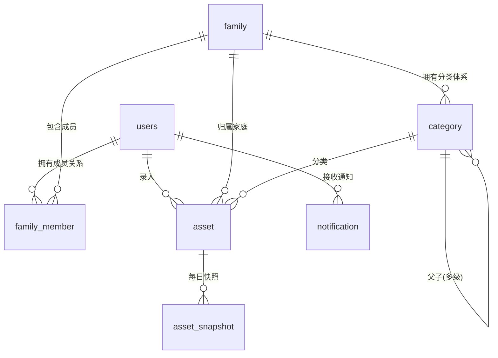

# ARISE V1 架构文档（ARCHITECTURE）

> 项目名称：ARISE — Asset Rising Intelligence & Strategy Engine  
> 版本：V1  
> 更新日期：2026-08-15  
> 依据文档：[PRD-V1.0.md](./requirements/PRD-V1.0.md)  
> 任务拆解请见：[TASKS.md](./TASKS.md)  
> UI 设计规格请见：[UI-DESIGN.md](./UI-DESIGN.md)

---

## 目录

1. [总体技术选型](#1-总体技术选型)
2. [前端代码架构](#2-前端代码架构)
3. [后端代码架构](#3-后端代码架构)
4. [数据库表结构设计（PostgreSQL）](#4-数据库表结构设计postgresql)
5. [API 接口清单](#5-api-接口清单)

---

## 1. 总体技术选型

| 层 | 技术 | 说明 |
|----|------|------|
| 前端框架 | React 18 + TypeScript | 类型安全，适合中型项目 |
| 构建工具 | Vite | 开发热更新快，构建产物优化好 |
| UI 组件库 | Ant Design Mobile（H5）+ Ant Design（桌面） | 移动端 H5 适配，响应式 |
| 图表 | D3.js（桑基图、柱状趋势图） | 高度定制化，满足水平桑基图需求 |
| 状态管理 | Zustand（轻量） | 登录态、家庭空间上下文、当前成员 |
| 路由 | React Router v6 | 页面路由与守卫 |
| HTTP | Axios（统一 API 层封装） | 拦截器、Token、错误处理 |
| 后端框架 | Python 3.11 + FastAPI | 异步高性能 |
| ORM | SQLAlchemy 2.0 + Alembic 迁移 | 数据访问 |
| 数据校验 | Pydantic v2 | 请求/响应模型 |
| 数据库 | **PostgreSQL 16** | 关系型，支持事务与聚合 |
| 缓存/中间件 | Redis | 验证码、图片验证码、登录态/单设备踢下线、限流 |
| 验证码服务 | 阿里云短信 / SMTP 邮件（按联系方式路由） | 短信/邮箱验证码 |
| 图片验证码 | 服务端生成 SVG/Captcha | 人机校验 |

**架构约束（遵循 AGENTS.md）**
- 前端：所有后端调用必须走统一 `src/api/` 层，业务逻辑抽离到 Hooks / Store，严禁写在组件内。
- 后端：严格 Router / Service / Repository 三层分离；所有外部输入用 Pydantic 校验；核心业务在 Service，CRUD 在 Repository。
- 响应统一格式：`{ code, message, data, request_id }`。

**认证模型（V1 简化）**
- **无密码**：全部登录均通过验证码完成，移除密码与「忘记密码」功能。
- **首次登录即注册**：不设独立注册页/注册流程。用户输入手机号或邮箱 + 验证码登录时，若账号不存在则自动创建账号并登录（`is_new_user` 标识返回前端）。

---

## 2. 前端代码架构

### 2.1 目录结构

```
frontend/
├── public/                              # 静态资源（favicon 等）
├── .env                                 # 通用环境变量（VITE_API_BASE_URL 等）
├── .env.development                     # 开发环境变量（http://localhost:8000）
├── .env.production                      # 生产环境变量（https://api.xxx.com）
├── .env.example                         # 变量模板（提交仓库，供其他开发者复制）
├── src/
│   ├── api/                             # 【统一 API 层】禁止在组件内直接 fetch/axios
│   │   ├── request.ts                   # axios 实例封装：baseURL、Token 注入、401 处理、统一错误提示
│   │   ├── auth.ts                      # 验证码/登录（首次自动注册）/登出/当前用户
│   │   ├── family.ts                    # 家庭空间、成员、邀请相关接口
│   │   ├── category.ts                  # 分类增删改、拆分、合并接口
│   │   ├── asset.ts                     # 资产/负债条目接口
│   │   ├── overview.ts                  # 总览、桑基图数据接口
│   │   ├── trend.ts                     # 趋势图数据接口
│   │   ├── notification.ts              # 站内信接口
│   │   └── user.ts                      # 个人资料、设置接口
│   ├── components/                      # 公共组件（单一职责）
│   │   ├── Layout/
│   │   │   ├── AppLayout.tsx            # 主布局（底部 Tab 栏 / 侧边栏，H5 响应式）
│   │   │   └── NavBar.tsx
│   │   ├── charts/
│   │   │   ├── HorizontalSankey.tsx     # 水平桑基图（D3，资产/负债分开展示，金额/百分比切换）
│   │   │   ├── TrendBarChart.tsx        # 月度/年度柱状趋势图（D3）
│   │   │   └── NetAssetCard.tsx         # 净资产与月度变化卡片（涨跌色）
│   │   ├── category/
│   │   │   ├── CategoryTree.tsx         # 分类树/列表
│   │   │   └── SplitCategoryModal.tsx   # 拆分输入卡片（动态加号）
│   │   ├── asset/
│   │   │   └── AssetForm.tsx            # 资产/负债新增编辑表单（级联选择末级分类）
│   │   ├── notification/
│   │   │   └── NotificationList.tsx
│   │   └── common/                      # 通用组件（Empty、ConfirmDialog、CaptchaInput 等）
│   ├── hooks/                           # 业务逻辑抽离
│   │   ├── useAuth.ts                   # 登录态、token 管理
│   │   ├── useFamily.ts                 # 当前家庭上下文、家庭/个人范围切换
│   │   ├── useOverview.ts               # 总览数据加载与格式化
│   │   └── useDebounce.ts
│   ├── pages/                           # 页面（路由级组件，UI 规格见 UI-DESIGN.md）
│   │   ├── auth/
│   │   │   └── LoginPage.tsx            # 登录页（验证码流程，首次登录自动注册）
│   │   ├── family/
│   │   │   ├── FamilyManagePage.tsx     # 家庭管理（创建/加入、成员管理、邀请、转让/退出）
│   │   │   └── InvitePage.tsx           # 邀请同意页（来自站内信）
│   │   ├── overview/
│   │   │   ├── OverviewPage.tsx         # 总览页（家庭/个人切换）
│   │   │   └── TrendPage.tsx            # 趋势页（月/年切换柱状图）
│   │   ├── asset/
│   │   │   ├── AssetListPage.tsx        # 资产/负债列表（成员/分类筛选）
│   │   │   ├── AssetEditPage.tsx        # 新增/编辑页
│   │   │   └── CategoryDetailPage.tsx   # 分类详情（条目列表 + 拆分入口）
│   │   ├── category/
│   │   │   └── CategoryManagePage.tsx   # 分类管理（多级树、拆分、合并）
│   │   ├── notification/
│   │   │   └── NotificationPage.tsx     # 站内信列表
│   │   └── settings/
│   │       └── SettingsPage.tsx         # 设置（个人资料、退出家庭、开放明细开关）
│   ├── router/
│   │   ├── index.tsx                    # 路由表
│   │   └── guards.tsx                   # 登录守卫、家庭空间守卫
│   ├── store/
│   │   ├── authStore.ts                 # 登录态
│   │   ├── familyStore.ts               # 当前家庭、范围（family/personal）
│   │   └── notificationStore.ts         # 未读消息数
│   ├── types/                           # 全局 TS 类型（与后端 schema 对齐）
│   │   ├── auth.ts / family.ts / category.ts / asset.ts / overview.ts / notification.ts
│   ├── utils/
│   │   ├── format.ts                    # 金额、百分比、日期格式化
│   │   ├── captcha.ts                   # 图片验证码交互
│   │   └── device.ts                    # H5 视口/移动端适配工具
│   ├── App.tsx
│   ├── main.tsx
│   └── styles/                          # 全局样式、主题（移动端适配，rem/vw）
├── index.html
├── vite.config.ts                       # 代理 /api → 后端（读取环境变量）
├── tsconfig.json
└── package.json
```

### 2.2 环境变量配置（.env）

Vite 环境变量需以 `VITE_` 前缀命名，通过 `import.meta.env.VITE_XXX` 读取。三套文件：

| 文件 | 用途 | 示例 |
|------|------|------|
| `.env` | 通用变量（所有环境生效） | `VITE_APP_TITLE=ARISE` |
| `.env.development` | 本地开发 | `VITE_API_BASE_URL=/api`（配合 Vite 代理）或 `http://localhost:8000/api` |
| `.env.production` | 生产构建 | `VITE_API_BASE_URL=https://api.xxx.com/api` |

- `vite.config.ts` 中 `server.proxy['/api']` 指向开发后端，代理目标地址从 `.env.development`（`VITE_DEV_PROXY_TARGET`）读取。
- `.env*` 均加入 `.gitignore`，仅提交 `.env.example` 模板。

### 2.3 关键设计说明

- **H5 适配**：基于 Ant Design Mobile 组件 + CSS 响应式（断点适配），视口 meta 设置 `width=device-width`，图表容器随视口自适应。
- **登录态**：Token 存于内存 + localStorage（持久化），`request.ts` 拦截器自动注入 `Authorization: Bearer <token>`；401 时清除登录态并跳转登录页。
- **首次登录自动注册**：登录接口返回 `is_new_user`，前端仅在成功文案上有区分（如“欢迎加入 ARISE”），无独立注册页面。
- **数据范围切换**：`familyStore` 维护 `scope`（family / personal），总览、列表页均依赖该状态请求不同范围数据。
- **水平桑基图**：D3 自定义布局，资产从「家庭总资产」节点水平流向各资产末级分类；负债独立一张；支持金额/百分比切换（父组件传 `displayMode`）。
- **拆分/合并交互**：拆分页动态输入卡片列表（加号新增），前端先做金额合计校验（快速反馈），最终以服务端校验为准。

---

## 3. 后端代码架构

### 3.1 目录结构

```
backend/
├── app/
│   ├── main.py                          # FastAPI 入口：CORS、路由注册、全局异常、文档
│   ├── core/
│   │   ├── config.py                    # 环境配置（pydantic-settings，读取 .env）
│   │   ├── security.py                  # Token 签发/校验、单设备登录、登录态管理
│   │   ├── redis.py                     # Redis 连接与操作封装
│   │   ├── rate_limit.py                # IP 限流、验证码发送间隔、失败锁定
│   │   ├── captcha.py                   # 图片验证码生成与校验
│   │   ├── sms.py                       # 短信/邮件验证码发送（按联系方式路由）
│   │   └── exceptions.py                # 统一异常与错误码
│   ├── api/
│   │   ├── deps.py                      # 依赖注入：get_db、get_current_user、get_family_permission
│   │   └── v1/
│   │       ├── router.py                # v1 路由汇总
│   │       └── endpoints/
│   │           ├── auth.py              # 验证码登录（首次自动注册）/登出/当前用户
│   │           ├── captcha.py           # 图片验证码获取/校验
│   │           ├── family.py            # 家庭创建/详情/退出
│   │           ├── member.py            # 邀请/成员列表/移除/转让/开放明细
│   │           ├── category.py          # 分类 CRUD/拆分/合并
│   │           ├── asset.py             # 资产条目 CRUD
│   │           ├── overview.py          # 总览/桑基图
│   │           ├── trend.py             # 趋势图
│   │           ├── notification.py      # 站内信/接受邀请
│   │           └── user.py              # 个人资料
│   ├── models/                          # SQLAlchemy ORM 模型（与第 4 节表结构一一对应）
│   │   ├── user.py / family.py / member.py / category.py
│   │   ├── asset.py / asset_snapshot.py / notification.py
│   │   └── base.py                      # 公共基类（id、created_at）
│   ├── schemas/                         # Pydantic 请求/响应模型（按模块分文件）
│   │   ├── auth.py / family.py / category.py / asset.py / overview.py / notification.py
│   ├── services/                        # 【业务逻辑层】核心规则与流程编排
│   │   ├── auth_service.py              # 验证码校验、首次自动注册、单设备登录
│   │   ├── family_service.py            # 家庭创建、成员权限、退出/移除数据清理
│   │   ├── category_service.py          # 多级分类、拆分金额校验、合并、删除提升
│   │   ├── asset_service.py             # 资产 CRUD + 快照记录（当天最后一次为准）
│   │   ├── overview_service.py          # 净资产汇总、月度变化、桑基图数据组装
│   │   ├── trend_service.py             # 日快照聚合为月/年趋势
│   │   └── notification_service.py      # 站内信、邀请处理
│   ├── repositories/                    # 【数据访问层】纯 CRUD
│   │   ├── user_repo.py / family_repo.py / member_repo.py
│   │   ├── category_repo.py / asset_repo.py / snapshot_repo.py / notification_repo.py
│   ├── utils/
│   │   ├── enums.py                     # 角色、状态、验证码场景等枚举
│   │   ├── time.py                      # 月度边界、月末计算
│   │   └── response.py                  # 统一 code/message/data 响应构造
│   └── db/
│       ├── session.py                   # 数据库会话（PostgreSQL 连接）
│       └── base.py
├── alembic/                             # 数据库迁移
│   ├── env.py
│   └── versions/
├── tests/                               # pytest 单元/集成测试
│   ├── conftest.py
│   ├── test_auth.py / test_family.py / test_category.py
│   ├── test_asset.py / test_overview.py / test_notification.py
├── requirements.txt
├── .env.example                         # 数据库/Redis/短信/邮件配置示例
└── README.md
```

### 3.2 关键设计说明

- **三层分离**：`Router` 只做参数接收与响应包装 → `Service` 承载业务规则（验证码防爆破、首次自动注册、拆分金额校验、退出清数据等）→ `Repository` 只做 SQL/ORM CRUD。
- **验证码体系**（Redis）：
  - 图片验证码：`captcha:{uuid}`，5 分钟过期，一次性。
  - 短信/邮箱验证码：`sms:{contact}`，5 分钟过期；发送间隔 60s；单日计数 `sms:day:{contact}` 上限 10 次。
  - 失败锁定：`fail:{contact}` 连续 5 次错误锁定 15 分钟。
  - IP 限流：`ratelimit:{ip}:{path}` 滑动窗口。
  - **无密码/无注册页**：验证码场景统一为登录（首次自动注册），不再区分 REGISTER/LOGIN。
- **首次自动注册**：`auth_service.login` 中先按 contact（手机号/邮箱）查询用户，不存在则创建用户记录，再签发 token，返回 `is_new_user: true`。
- **单设备登录**：登录成功后生成 `device_id`，Redis 记录 `session:{user_id} → token`；新登录覆盖旧值并使其失效（旧 token 校验时发现不匹配即 401）。
- **登录态 24h**：Token 过期时间 24h，无刷新续期逻辑（超时重新登录）。
- **数据权限**：`deps.get_family_permission` 校验请求者是否为该家庭 ACTIVE 成员；个人数据按 `user_id` 隔离；明细开放通过 `family_member.is_detail_visible` 控制。

---

## 4. 数据库表结构设计（PostgreSQL）

> 数据库：**PostgreSQL 16**（UTF8）；金额统一 `NUMERIC(18,2)`；时间统一 `TIMESTAMPTZ`（记账日期用 `DATE`）。  
> 主键统一：`BIGINT GENERATED BY DEFAULT AS IDENTITY PRIMARY KEY`。

### 4.1 ER 总览



### 4.2 表结构明细

#### 4.2.1 `users` 用户表

| 字段 | 类型 | 约束 | 说明 |
|------|------|------|------|
| id | BIGINT | IDENTITY PK | 用户 ID |
| phone | VARCHAR(20) | NULL, UNIQUE | 手机号（与邮箱至少一个非空） |
| email | VARCHAR(255) | NULL, UNIQUE | 邮箱 |
| created_at | TIMESTAMPTZ | NOT NULL, DEFAULT now() | 创建时间 |

- 索引：`uk_phone`、`uk_email`

#### 4.2.2 `family` 家庭空间表

| 字段 | 类型 | 约束 | 说明 |
|------|------|------|------|
| id | BIGINT | IDENTITY PK | 家庭 ID |
| name | VARCHAR(100) | NOT NULL | 家庭名称 |
| creator_id | BIGINT | NOT NULL, FK → users.id | 创建者 ID |
| created_at | TIMESTAMPTZ | NOT NULL, DEFAULT now() | 创建时间 |

- 索引：`idx_creator_id`

#### 4.2.3 `family_member` 家庭成员表

| 字段 | 类型 | 约束 | 说明 |
|------|------|------|------|
| id | BIGINT | IDENTITY PK | 主键 |
| family_id | BIGINT | NOT NULL, FK → family.id | 家庭 ID |
| user_id | BIGINT | NOT NULL, FK → users.id | 用户 ID |
| role | VARCHAR(20) | NOT NULL, DEFAULT 'MEMBER' | 角色：`CREATOR` / `MEMBER` |
| is_detail_visible | BOOLEAN | NOT NULL, DEFAULT FALSE | 是否开放个人明细给其他成员 |
| status | VARCHAR(20) | NOT NULL, DEFAULT 'ACTIVE' | 状态：`ACTIVE` / `LEFT` / `REMOVED` |
| joined_at | TIMESTAMPTZ | NOT NULL, DEFAULT now() | 加入时间 |

- 唯一约束：`uk_family_user(family_id, user_id)`；索引：`idx_user_id`
- 建议 CHECK：`role IN ('CREATOR','MEMBER')`、`status IN ('ACTIVE','LEFT','REMOVED')`
- 说明：退出/被移除的成员保留记录（status 标记），用于幂等校验与历史留痕。

#### 4.2.4 `category` 分类表（多级树）

| 字段 | 类型 | 约束 | 说明 |
|------|------|------|------|
| id | BIGINT | IDENTITY PK | 分类 ID |
| family_id | BIGINT | NOT NULL, FK → family.id | 所属家庭（家庭内共享一套分类） |
| parent_id | BIGINT | NULL, FK → category.id | 父分类 ID，NULL 为一级分类 |
| name | VARCHAR(100) | NOT NULL | 分类名称 |
| created_at | TIMESTAMPTZ | NOT NULL, DEFAULT now() | 创建时间（排序依据） |

- 索引：`idx_family_parent(family_id, parent_id)`；`idx_parent_id`

#### 4.2.5 `asset` 资产/负债条目表

| 字段 | 类型 | 约束 | 说明 |
|------|------|------|------|
| id | BIGINT | IDENTITY PK | 条目 ID |
| user_id | BIGINT | NOT NULL, FK → users.id | 归属人（录入者） |
| family_id | BIGINT | NOT NULL, FK → family.id | 所属家庭 |
| category_id | BIGINT | NOT NULL, FK → category.id | 分类（必须为**最后一级**） |
| name | VARCHAR(100) | NOT NULL | 名称（如“招商银行活期”） |
| amount | NUMERIC(18,2) | NOT NULL | 当前金额 |
| account_type | VARCHAR(50) | NOT NULL, DEFAULT '银行存款' | 账户类型（默认：银行存款/股票/基金，可修改） |
| remark | VARCHAR(500) | NULL | 备注 |
| created_at | TIMESTAMPTZ | NOT NULL, DEFAULT now() | 创建时间 |
| book_date | DATE | NOT NULL | 记账日期（手动选择，用于可视化） |

- 索引：`idx_family(family_id)`、`idx_user(user_id)`、`idx_category(category_id)`、`idx_family_book(family_id, book_date)`
- 说明：不区分资产/负债，通过「分类」归属判断（负债分类由业务层约定标识）。

#### 4.2.6 `asset_snapshot` 数据快照表

| 字段 | 类型 | 约束 | 说明 |
|------|------|------|------|
| id | BIGINT | IDENTITY PK | 快照 ID |
| asset_id | BIGINT | NOT NULL, FK → asset.id, **ON DELETE CASCADE** | 条目 ID |
| amount | NUMERIC(18,2) | NOT NULL | 快照金额 |
| record_date | DATE | NOT NULL | 记录日期（天维度） |

- 唯一约束：`uk_asset_date(asset_id, record_date)`
- 说明：修改金额时 upsert 当天记录（以当天最后一次变更结束时的数据为准）；仅变更日有数据，无记录的天不展示。

#### 4.2.7 `notification` 通知表

| 字段 | 类型 | 约束 | 说明 |
|------|------|------|------|
| id | BIGINT | IDENTITY PK | 通知 ID |
| user_id | BIGINT | NOT NULL, FK → users.id | 接收用户 ID |
| type | VARCHAR(20) | NOT NULL | 类型：`INVITE` 等 |
| content | TEXT | NOT NULL | 内容（邀请含家庭名称/邀请人） |
| status | VARCHAR(20) | NOT NULL, DEFAULT 'UNREAD' | 状态：`UNREAD` / `READ` / `ACCEPTED` / `REJECTED` |
| ref_id | BIGINT | NULL | 关联对象 ID（邀请场景为家庭 ID，用于跳转与幂等） |
| created_at | TIMESTAMPTZ | NOT NULL, DEFAULT now() | 创建时间 |

- 索引：`idx_user_status(user_id, status)`

#### 4.2.8 `verification_code` 验证码记录表（兜底持久化）

> 运行期验证码主存 Redis；本表用于审计与重启兜底。

| 字段 | 类型 | 约束 | 说明 |
|------|------|------|------|
| id | BIGINT | IDENTITY PK | 主键 |
| contact | VARCHAR(255) | NOT NULL | 手机号或邮箱 |
| scene | VARCHAR(20) | NOT NULL | 场景：`LOGIN`（首次自动注册，统一场景） |
| code | VARCHAR(10) | NOT NULL | 验证码（存哈希） |
| expires_at | TIMESTAMPTZ | NOT NULL | 过期时间 |
| created_at | TIMESTAMPTZ | NOT NULL, DEFAULT now() | 创建时间 |

- 索引：`idx_contact_scene(contact, scene)`

### 4.3 关键关联与业务约束

| 关系 | 说明 |
|------|------|
| users ↔ family_member ↔ family | 用户-家庭多对多，通过成员表；角色与状态在成员表 |
| category.parent_id | 自关联多级树，按 created_at 排序 |
| asset.category_id | 必须指向**末级**分类（Service 校验） |
| asset_snapshot.asset_id | 一资产多快照，同一天唯一（当天最后一次覆盖），级联删除 |
| notification.ref_id | 邀请通知关联家庭 ID，幂等防重复加入 |

**数据清理规则（成员退出/被移除）**：事务内删除该成员在该家庭的全部 `asset`（`asset_snapshot` 级联删除）；对因删除而变空的末级分类自动删除；个人空间数据不受影响。

---

## 5. API 接口清单

> 统一前缀：`/api/v1`  
> 统一响应：`{ "code": 0, "message": "ok", "data": {...}, "request_id": "..." }`（code=0 成功，非 0 见错误码表）  
> 认证：除公开接口外，均需 `Authorization: Bearer <token>`  
> **说明**：无密码、无注册接口；登录接口承担「首次自动注册」。

### 5.1 认证模块（公开/登录态）

| # | 方法 | 路径 | 说明 | 请求 | 响应 data | 权限 |
|---|------|------|------|------|-----------|------|
| 1 | GET | `/auth/captcha/image` | 获取图片验证码 | - | `{ captcha_id, image_base64 }` | 公开 |
| 2 | POST | `/auth/code/send` | 发送短信/邮箱验证码（登录用） | `{ contact, captcha_id, captcha_code }` | `{}` | 公开（需通过图片验证码 + 限流） |
| 3 | POST | `/auth/login` | 验证码登录；**账号不存在则自动注册**（单设备） | `{ contact, code }` | `{ token, expires_in: 86400, user, is_new_user }` | 公开 |
| 4 | POST | `/auth/logout` | 登出（失效当前 token） | - | `{}` | 登录 |
| 5 | GET | `/auth/me` | 获取当前用户信息 | - | `{ user }` | 登录 |

### 5.2 家庭与成员模块

| # | 方法 | 路径 | 说明 | 请求 | 响应 data | 权限 |
|---|------|------|------|------|-----------|------|
| 6 | POST | `/families` | 创建家庭空间 | `{ name }` | `{ family }` | 登录 |
| 7 | GET | `/families` | 我加入的家庭列表 | - | `{ families: [] }` | 登录 |
| 8 | GET | `/families/{family_id}` | 家庭详情（含成员） | - | `{ family, members: [] }` | 家庭成员 |
| 9 | POST | `/families/{family_id}/members/invite` | 邀请成员（按手机号） | `{ phone }` | `{}` | 仅创建者 |
| 10 | GET | `/families/{family_id}/members` | 成员列表 | - | `{ members: [{user_id, name, role, is_detail_visible, net_asset}] }` | 家庭成员 |
| 11 | DELETE | `/families/{family_id}/members/{user_id}` | 移除成员（触发数据清理） | - | `{}` | 仅创建者 |
| 12 | POST | `/families/{family_id}/members/{user_id}/transfer` | 转让创建者身份 | - | `{}` | 仅创建者 |
| 13 | PUT | `/families/{family_id}/members/{user_id}/detail-visibility` | 开放/关闭个人明细 | `{ is_detail_visible: bool }` | `{}` | 本人 |
| 14 | POST | `/families/{family_id}/leave` | 主动退出家庭（触发数据清理） | - | `{}` | 家庭成员 |

### 5.3 分类模块

| # | 方法 | 路径 | 说明 | 请求 | 响应 data | 权限 |
|---|------|------|------|------|-----------|------|
| 15 | GET | `/families/{family_id}/categories` | 分类树（按创建时间排序） | - | `{ categories: [树] }` | 家庭成员 |
| 16 | POST | `/families/{family_id}/categories` | 新增分类 | `{ name, parent_id? }` | `{ category }` | 家庭成员 |
| 17 | PUT | `/categories/{category_id}` | 修改分类名称 | `{ name }` | `{}` | 家庭成员 |
| 18 | DELETE | `/categories/{category_id}` | 删除分类（一级删除时二级自动提升） | - | `{}` | 家庭成员 |
| 19 | POST | `/categories/{category_id}/split` | 拆分末级分类 | `{ children: [{name, amount}] }` | `{}` | 家庭成员 |
| 20 | POST | `/categories/merge` | 合并分类 | `{ category_ids: [], new_name }` | `{}` | 家庭成员 |

**拆分校验逻辑**：所有 `children.amount` 之和必须等于原分类下资产总额，否则返回错误（含「原分类剩余金额」提示）。

### 5.4 资产/负债模块

| # | 方法 | 路径 | 说明 | 请求 | 响应 data | 权限 |
|---|------|------|------|------|-----------|------|
| 21 | GET | `/assets` | 资产/负债列表 | Query: `family_id, member_id?, category_id?, keyword?` | `{ assets: [], total }` | 家庭成员（明细受 is_detail_visible 控制） |
| 22 | POST | `/assets` | 新增条目（自动写当日快照） | `{ family_id, category_id, name, amount, account_type?, remark?, book_date }` | `{ asset }` | 家庭成员 |
| 23 | GET | `/assets/{asset_id}` | 条目详情 | - | `{ asset }` | 本人/可见成员 |
| 24 | PUT | `/assets/{asset_id}` | 修改（金额变更自动 upsert 当日快照） | `{ name?, amount?, category_id?, account_type?, remark?, book_date? }` | `{ asset }` | 本人 |
| 25 | DELETE | `/assets/{asset_id}` | 删除条目（级联删除快照） | - | `{}` | 本人 |

### 5.5 总览/可视化模块

| # | 方法 | 路径 | 说明 | 请求 | 响应 data | 权限 |
|---|------|------|------|------|-----------|------|
| 26 | GET | `/overview/summary` | 净资产总览 | Query: `family_id?, scope: family\|personal` | `{ net_asset, monthly_change, members: [{user_id, net_asset, monthly_change}] }` | 家庭成员/本人 |
| 27 | GET | `/overview/sankey` | 桑基图数据（水平） | Query: `family_id?, scope, display: amount\|percent` | `{ assets: [{name, value, children}], liabilities: [...] }` | 家庭成员/本人 |
| 28 | GET | `/overview/trend` | 趋势柱状图数据 | Query: `family_id?, scope, granularity: month\|year, category_id?` | `{ series: [{label, total_asset, total_liability, net_asset}], categories: [...] }` | 家庭成员/本人 |

### 5.6 通知模块

| # | 方法 | 路径 | 说明 | 请求 | 响应 data | 权限 |
|---|------|------|------|------|-----------|------|
| 29 | GET | `/notifications` | 通知列表 | Query: `status?` | `{ notifications: [], unread_count }` | 登录 |
| 30 | PUT | `/notifications/{id}/read` | 标记已读 | - | `{}` | 本人 |
| 31 | POST | `/notifications/{id}/accept` | 同意邀请（加入家庭） | - | `{}` | 本人 |
| 32 | POST | `/notifications/{id}/reject` | 拒绝邀请 | - | `{}` | 本人 |

### 5.7 用户模块

| # | 方法 | 路径 | 说明 | 请求 | 响应 data | 权限 |
|---|------|------|------|------|-----------|------|
| 33 | PUT | `/users/me` | 更新个人资料（昵称） | `{ nickname? }` | `{ user }` | 登录 |

### 5.8 错误码约定（示例）

| code | message | 场景 |
|------|---------|------|
| 0 | ok | 成功 |
| 1001 | 图片验证码错误或已过期 | 人机校验失败 |
| 1002 | 验证码错误 | 短信/邮箱验证码错误 |
| 1003 | 发送过于频繁 | 60s 间隔限制 |
| 1004 | 当日发送次数超限 | 10 次/日 |
| 1005 | 操作被锁定 | 连续失败 5 次锁定 15 分钟 |
| 3001 | 无权限操作 | 非创建者/非成员 |
| 3002 | 拆分金额不一致 | 拆分校验失败 |
| 4001 | 未认证或登录已失效 | 401 |
| 4002 | 已被其他设备登录 | 单设备踢下线 |
