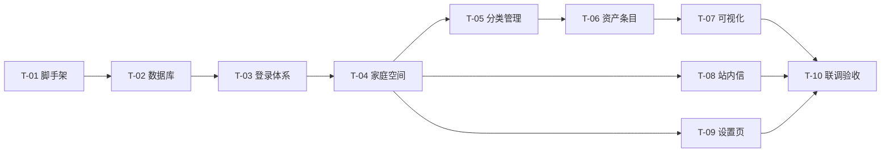

# ARISE V1 任务列表（TASKS）

> 项目名称：ARISE — Asset Rising Intelligence & Strategy Engine  
> 版本：V1  
> 更新日期：2026-08-15  
> 架构与接口细节请见：[ARCHITECTURE.md](./ARCHITECTURE.md)  
> UI 设计规格请见：[UI-DESIGN.md](./UI-DESIGN.md)

---

## 任务总览

> 状态说明：⬜ 未开始 ｜ 🔵 进行中 ｜ ✅ 已完成

| 编号 | 任务名称 | 依赖 | 状态 |
|------|----------|------|------|
| T-01 | 项目脚手架搭建（前端 + 后端 + 环境配置） | - | ✅ 已完成 |
| T-01-TEST | T-01 脚手架验收 | T-01 | ✅ 已完成 |
| T-02 | 数据库初始化与迁移（PostgreSQL） | T-01 | ✅ 已完成 |
| T-02-TEST | T-02 数据库迁移验收 | T-02 | ✅ 已完成 |
| T-03 | 验证码登录体系（首次登录自动注册） | T-01、T-02 | ✅ 已完成 |
| T-03-TEST | T-03 认证体系验收 | T-03 | ✅ 已完成 |
| T-04 | 家庭空间与成员管理 | T-03 | ⬜ 未开始 |
| T-05 | 分类管理（多级树 / 拆分 / 合并） | T-04 | ⬜ 未开始 |
| T-06 | 资产/负债条目管理 | T-05 | ⬜ 未开始 |
| T-07 | 数据可视化（总览 / 桑基图 / 趋势图） | T-05、T-06 | ⬜ 未开始 |
| T-08 | 站内信与通知 | T-04 | ⬜ 未开始 |
| T-09 | 设置页与个人资料 | T-04、T-06 | ⬜ 未开始 |
| T-10 | 整体联调、安全加固与验收 | T-03 ~ T-09 | ⬜ 未开始 |

---

## 详细任务

### T-01 项目脚手架搭建（前端 + 后端 + 环境配置）

- **任务名称**：初始化前后端工程与基础框架
- **涉及页面/接口**：无（基础工程）
- **依赖**：无
- **内容**：
  - Vite + React + TS 工程；Ant Design Mobile/Ant Design、D3、Zustand、Axios 集成
  - 前端环境变量：`.env`、`.env.development`、`.env.production`、`.env.example`（区分开发/生产 API 地址），`.env*` 加入 `.gitignore`
  - FastAPI + SQLAlchemy + Alembic + Pydantic 工程（PostgreSQL）
  - 统一响应结构、CORS、配置中心
- **验收标准**：
  - 前后端可启动，`/api/v1/health` 返回统一响应结构
  - 前端代理 `/api` 到后端成功；开发/生产环境变量切换生效
  - 数据库迁移命令可执行，空库建表成功
  - Lint/格式化通过（ESLint、Ruff）

### T-02 数据库初始化与迁移（PostgreSQL）

- **任务名称**：建库建表（ARCHITECTURE 第 4 节全部表）与初始迁移
- **涉及页面/接口**：无
- **依赖**：T-01
- **验收标准**：
  - 8 张表全部创建成功，字段/约束/索引与设计一致（PostgreSQL 类型：BIGINT IDENTITY、NUMERIC、BOOLEAN、TIMESTAMPTZ、DATE）
  - Alembic 可升级/降级
  - 默认分类种子数据（银行存款、股票、基金）可初始化

### T-03 验证码登录体系（首次登录自动注册）

- **任务名称**：图片验证码 + 短信/邮箱验证码 + 登录（首次自动注册）+ 单设备登录
- **涉及页面/接口**：登录页 ｜ 接口 #1~#5
- **依赖**：T-01、T-02
- **验收标准**：
  - 手机号/邮箱二选一 + 图片验证码 + 短信/邮箱验证码可完成登录；**首次登录（账号不存在）自动注册并登录**，无独立注册页面
  - 无密码、无「忘记密码」入口
  - 验证码 5 分钟有效、60s 发送间隔、单日 10 次上限、连续错 5 次锁定 15 分钟、IP 限流生效
  - 登录态 24h 有效；新设备登录后旧设备请求返回 4002
  - 登录成功进入个人空间（可创建或加入家庭）

### T-04 家庭空间与成员管理

- **任务名称**：创建家庭、邀请、成员管理、权限、退出/移除清理
- **涉及页面/接口**：家庭管理页、邀请页 ｜ 接口 #6~#14、#29~#32
- **依赖**：T-03（依赖登录态）
- **验收标准**：
  - 创建者创建家庭、按手机号邀请（仅创建者），被邀请人站内信同意后成为成员
  - 成员列表展示角色；创建者可移除/转让，成员可退出
  - 成员退出/被移除：其家庭内资产条目删除、空分类自动删除、个人数据保留
  - 家庭/个人数据隔离正确；默认成员仅见汇总，开放明细后可见
  - 加入家庭后默认「家庭总览」

### T-05 分类管理（多级树 / 拆分 / 合并）

- **任务名称**：分类 CRUD、末级拆分、合并、删除提升
- **涉及页面/接口**：分类管理页、分类详情页 ｜ 接口 #15~#20
- **依赖**：T-04
- **验收标准**：
  - 支持多级分类（如 基金 → 支付宝/微信），按创建时间固定排序
  - 删除一级分类时二级自动提升为一级
  - 拆分：仅末级可拆，支持动态添加多个输入卡片；金额之和不等于原金额时失败并提示剩余金额；相等时原分类删除、条目按金额分配
  - 合并：选择多个分类 + 指定新名称，确认后原分类删除、条目归入新分类，不可撤销
  - 一人修改分类，全家庭成员可见（共享分类体系）

### T-06 资产/负债条目管理

- **任务名称**：条目增删改查、快照记录、筛选
- **涉及页面/接口**：资产列表页、资产编辑页 ｜ 接口 #21~#25
- **依赖**：T-05（依赖分类）
- **验收标准**：
  - 新增/编辑条目：名称、末级分类（级联选择）、金额、账户类型、备注、记账日期
  - 修改金额自动 upsert 当天快照（一天多次修改以最后一次为准）；仅变更日有记录
  - 列表支持按成员、分类筛选；成员明细权限控制生效
  - 删除条目级联删除快照
  - 账户类型默认「银行存款/股票/基金」且可修改

### T-07 数据可视化（总览 / 桑基图 / 趋势图）

- **任务名称**：家庭/个人总览、水平桑基图、月/年趋势图
- **涉及页面/接口**：总览页、趋势页 ｜ 接口 #26~#28
- **依赖**：T-05、T-06（依赖数据）
- **验收标准**：
  - 家庭/个人总览正确展示净资产、净资产月度变化（涨跌色）
  - 家庭总览展示所有成员净资产及月度变化；成员明细按权限展示
  - 水平桑基图：资产从「家庭总资产」流向各资产分类；负债独立展示；支持金额/百分比切换；个人总览仅资产部分
  - 趋势图：柱状图展示总资产/总负债/净资产及各类别趋势；按月/年切换；数据来自日快照（仅变更日）
  - 首屏 < 2s，图表交互 < 200ms（合理分页/懒加载）

### T-08 站内信与通知

- **任务名称**：邀请通知列表、已读、同意/拒绝邀请
- **涉及页面/接口**：通知页、邀请页 ｜ 接口 #29~#32
- **依赖**：T-04
- **验收标准**：
  - 接收邀请通知，未读数展示
  - 同意后加入家庭并可看到家庭数据；拒绝后通知状态更新
  - 重复同意同一邀请幂等处理（不重复加入）

### T-09 设置页与个人资料

- **任务名称**：个人资料、退出家庭、开放明细开关
- **涉及页面/接口**：设置页 ｜ 接口 #13、#14、#33
- **依赖**：T-04、T-06
- **验收标准**：
  - 可更新个人资料（昵称）
  - 可开启/关闭个人明细开放
  - 可退出当前家庭，二次确认后执行数据清理

### T-10 整体联调、安全加固与验收

- **任务名称**：前后端联调、HTTPS/安全加固、回归测试
- **涉及页面/接口**：全部
- **依赖**：T-03 ~ T-09
- **验收标准**：
  - 对照 PRD 第 9 节「验收标准」逐条通过
  - 全站接口统一响应结构与 request_id；HTTPS 配置
  - 单设备登录、数据隔离、防爆破限流在集成环境验证通过
  - 单元测试 + 接口联调（Swagger/Postman）通过，Lint 无错误
  - 移动端 H5 关键流程（登录→建家庭→录数据→看总览）在手机浏览器验证通过

---

## 建议执行顺序

